# 快適な制作環境の作り方

<center style="font-size:32px ;font-weight: bold;">機材・ワークフローを整えて、強固な制作基盤をつくる </center>


## 自己紹介

### Tomoya Eguchi (Cumuloworks)

**Freelance Director**
Motion Designer, CG Generalist
最近はちょっと Developer ?

- 2014 年 映像制作を始める
- 2017 年 大学に通いながらフリーランスに
- 2018 年 株式会社ナナメ 入社
- 2020 年 退社、独立してフリーランスに
- 2021 年 法人化

<!-- 最近は、会社として映像制作 -->


### [合同会社キュムロワークス](https://cumulo.works/company/)

**Cumuloworks, Inc.**

- 2021 年 9 月設立 (もうすぐ 4 期目)
- 広告・エンタメ双方の CG 映像制作がメイン
- 6 月からは[@shgumo](https://twitter.com/shgumo)との 2 名体制

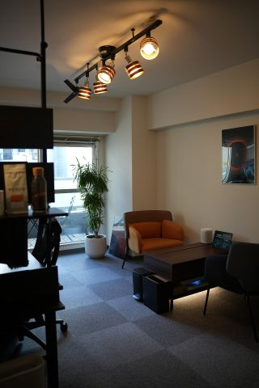

### [SHOWREEL 2024](https://cumulo.works/)

<video src="assets/video/Cumuloworks_SHOWREEL2024_vgt.mp4" controls ></video>

### <!-- 最近のWORK -->


## 本日の内容

1. 機材紹介
   Cumuloworks,Inc. で導入している機材の紹介

2. ワークフロー紹介
   機材をどのように制作に活かしているか

3. 今後の展望
   最近興味があること、今後の拡張の計画（妄想）

## 質問の方法

**質問は随時受け付けています!**

- 方法 1: Twitter の DM にて!
- 方法 2: マシュマロにて → 匿名が可能!


## 機材

### ラック ([StarTech 4POSTRACK8U](https://www.startech.com/ja-jp/server-management/4postrack8u))

2023 年に導入したラック

- 奥行きを調整できるタイプで、高さは 8U
- デスク周りに機材が散らばらず、コンパクトに収まる
- 見た目がクールだが、あらゆる付属品の価格が高い

  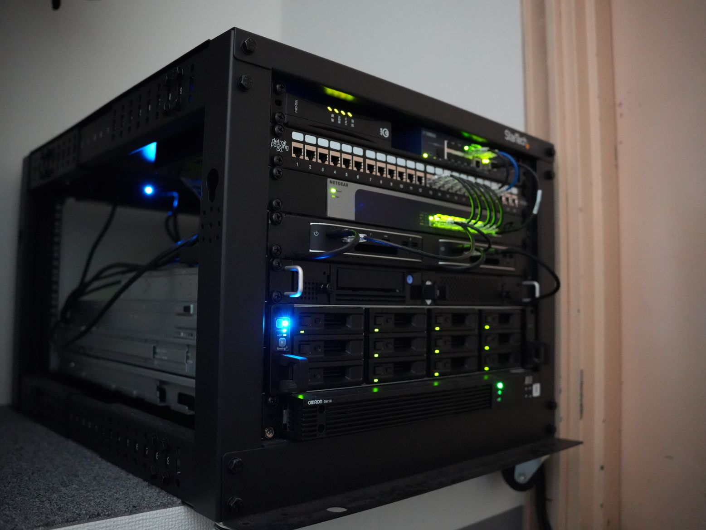

### ラック構成

<center>

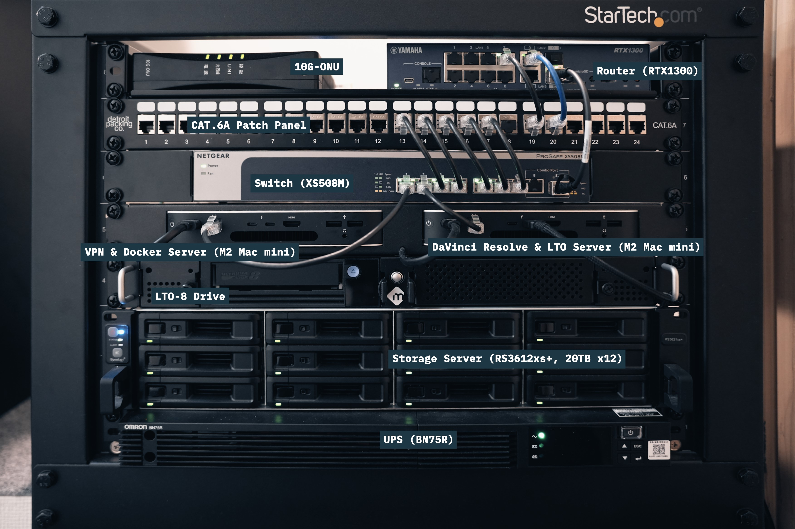

</center>

### メインルーター ([YAMAHA RTX1300](https://network.yamaha.com/products/routers/rtx1300/))

**NTT 光クロス(10Gbps)** を引き込んでいる

- NTT のレンタルルーター([XG-100NE](https://web116.jp/shop/hikari_r/xg_100ne/xg_100ne_00.html))よりも高い安定性
- **高スループットの回線**を契約することにより、データのやり取りでストレスが減った
- インターネットに直に接する機材 → セキュリティ面で重要な役割

💡 Mac アドレスを基に、主要な LAN 内デバイスの IP アドレスをルーター側で固定

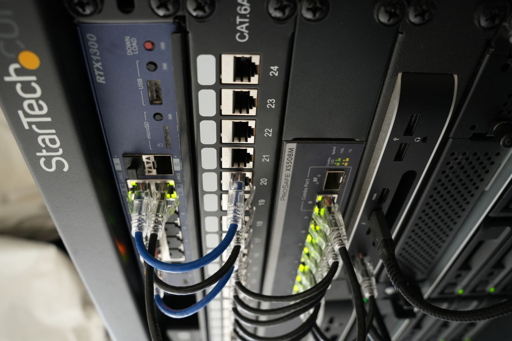

### メインスイッチ ([NETGEAR XS508M](https://www.netgear.com/jp/business/wired/switches/unmanaged/xs508m))

8 ポートのシンプルな **オール 10GbE** スイッチ

- 排熱も良好で、本格的に 10GbE 化を始めたい方にはおすすめ
- ここから各作業用マシン・サーバーなどへネットワークが分配される
- 8 ポートで足りず、買い替えを検討中

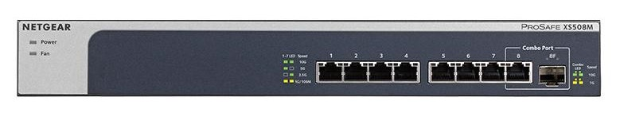


### UPS ([OMRON BN75R](https://socialsolution.omron.com/jp/ja/products_service/ups/product/bn75-300r/bn75-300r.html))

ラック全体の電源をバックアップする、最大 680W 対応の UPS

- 現環境の高負荷時で、10 分程度は電力を維持可能
- 前面の液晶ディスプレイで、電力消費量やバッテリー残量などが確認できて便利
- NAS と USB 接続することで、電力喪失時に安全にシャットダウンされる
- 商用電源が不安定になっても、安全に電力供給できる（見落とされがちなメリット）
  - 電力逼迫で、電圧低下や周波数不安定化が起こることは今後もありそう

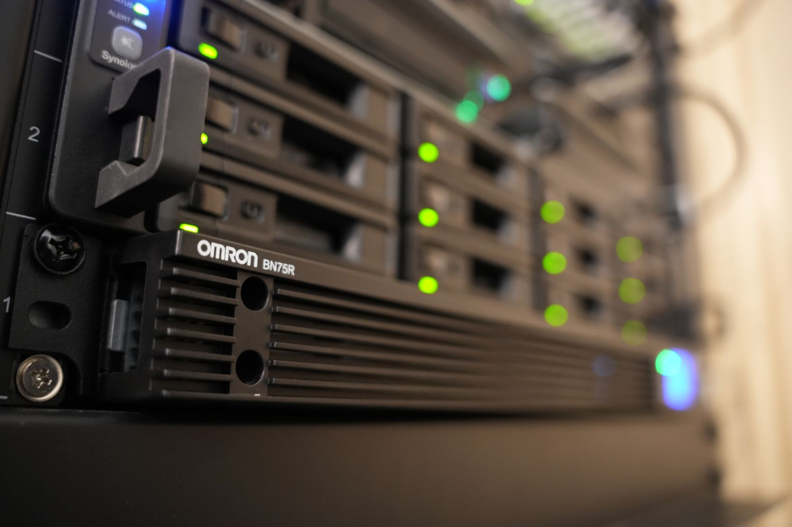

### ネットワーク構成

- すべて 10GbE (Cat.6A) 接続
- 10GbE スイッチを介して相互接続
- NAS は 20GbE 帯域を確保
  - 理論上、Internet <-> NAS と、各マシン <-> NAS それぞれで 10Gbps の帯域を確保
- RJ45 にしている理由
  - コスト面 + ケーブルの取り回しに気を使う
  - 結局 RJ45 に変換する必要がある

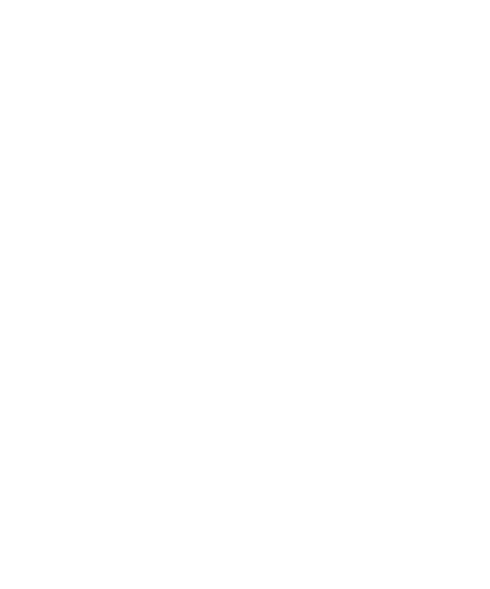

### メインストレージサーバー ([Synology RS3621xs+](https://www.synology.com/ja-jp/products/RS3621xs+))

2023 年導入の **200TB**のメインサーバー
**ストレージ以外の機能**も集約

```plaintext
Intel® Xeon® D-1541 8-core 2.1 GHz
RAM: 32GB DDR4 ECC RDIMM (2x 16GB)

12x 20TB Ultrastar DC HC560 (7200rpm)
  +
2x 800GB Synology SNV3510 NVMe SSD (Cache)

SHR-2 (RAID 6) ... 2 ディスク障害耐性
```

💡 データセンター用の HDD を採用

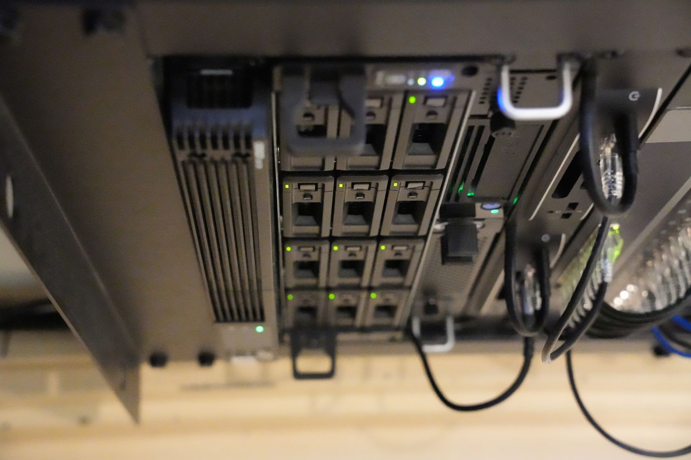

### 0. 導入のきっかけ

Google Drive の容量無制限が**サ終**
↓
「保存したかったら年間 400 万円払ってね」

```plaintext
Google Workspace 追加ストレージ アドオン サブスクリプションの
ご利用料金は月額 300 米ドルです
購入すると、ストレージ プールに 10 TB が追加されます
```

↓
行き場を失った 100TB のデータ
↓
**オンプレ化を決意**
↓
以後、**ストレージ以外もオンプレ化**の流れ

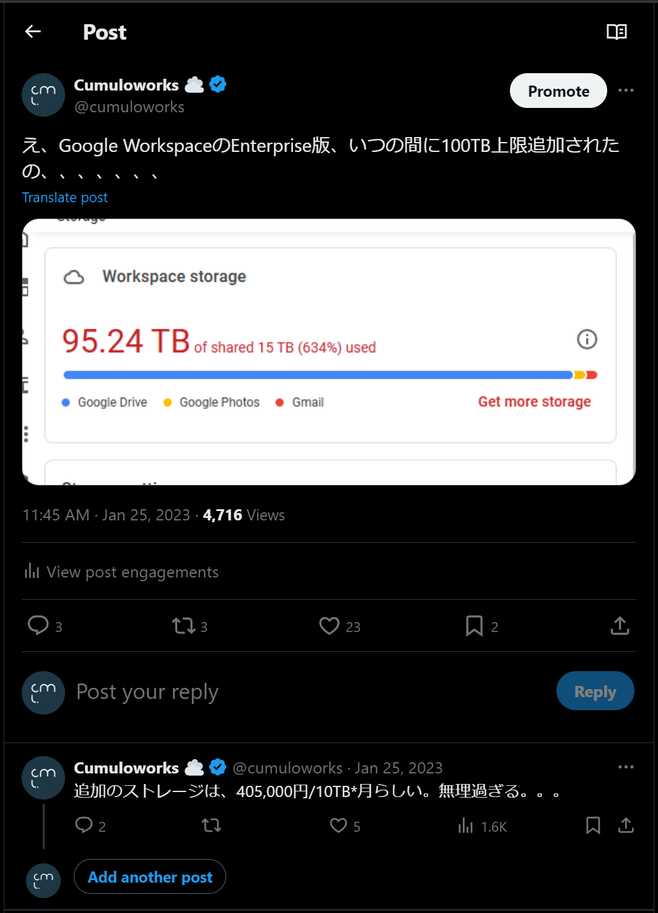

### なぜオンプレ化を推し進めるのか (メリット vs リスク)

<!-- オンプレという言葉の意味について触れた方が良い -->

#### メリット

- **常にデータが手元にある安心感**
  - TB 単位のデータは、クラウドにアップロード・ダウンロードするだけで膨大な時間がかかる
- サードパーティーのサービスへの依存から脱却できる
  - 急なサービス内容の変更や価格改定による影響を受けない
- たのしい・クール

#### デメリット（リスク = 対策が必要）

- ランサムウェア・物理的な盗難など、セキュリティ面での不安
- 災害などによるデータ損失リスク
- ストレージなどの機材の購入・管理コストがかかる

💡 Synology のようなパッケージで、デメリットを最小化

### 1. ストレージサーバーとして

<!-- ここからは使用例の解説 -->

プロジェクトファイル・アセットなどを集約

- SMB プロトコル + 10GbE 接続で、高速なファイルアクセス
- 社内でデータをリアルタイム共有(同期のラグなし)
- アクセスログ・バージョン履歴の保存 (Synology Drive)
  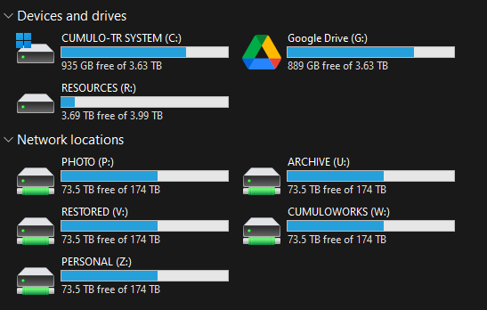

### 2. バージョン管理 (Version Explorer)

すべてのフォルダ・ファイルの変更を保存し、削除したデータも含めて任意のタイミングに遡ることができる([Synology Drive](https://www.synology.com/ja-jp/dsm/feature/drive))

- 間違えてファイルを上書きしてしまった
- 途中からプロジェクトファイルが壊れた
- 前のレンダーデータが必要になった

💡Intelliversioning 機能によって、最低限の容量で差分バックアップ

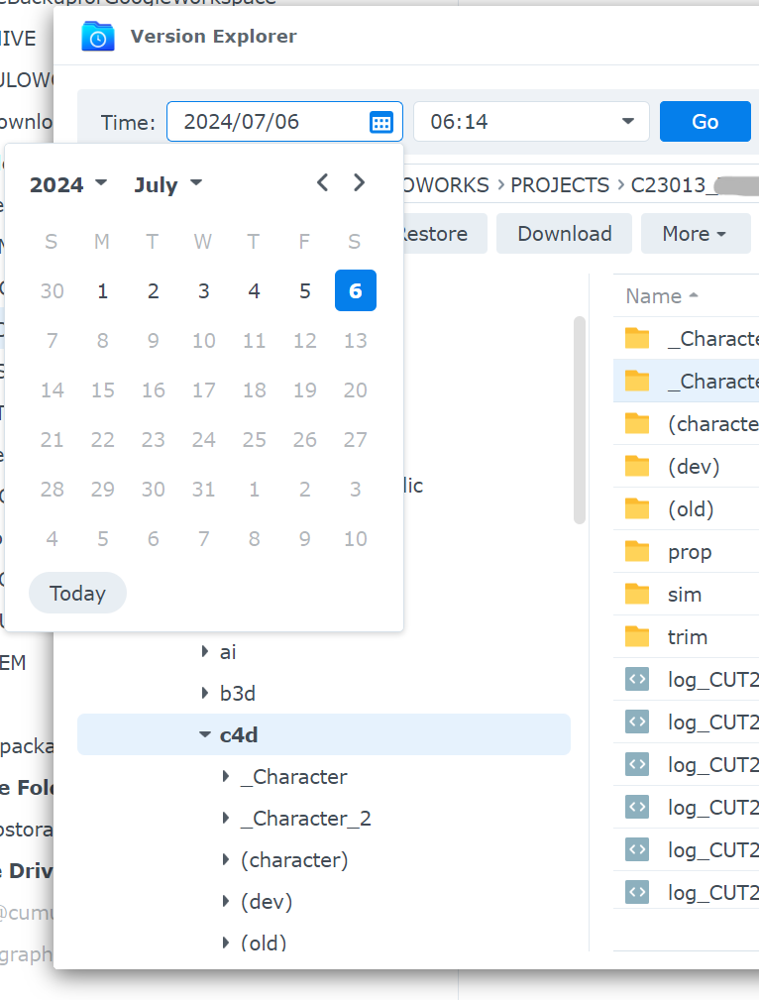

### 3. 社外とのファイル同期

[Synology Drive](https://www.synology.com/ja-jp/dsm/feature/drive) を使って、NAS 上のフォルダ・ファイルを社外の共同作業者に同期してもらう

- オンプレミスの Dropbox のような感じ
- ユーザーとファイルの組み合わせで、細かく権限を設定可能

#### 使用例

- 社内で制作したモデルデータをリアルタイムで受け渡し
- 社外で作業してもらったデータをアップロードしてもらう

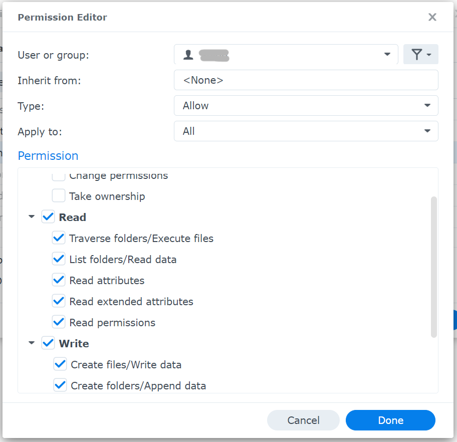

### 4. 社外とのファイルのリンク共有

ファイルの共有リンクを発行して、外部の人にファイルをダウンロードしてもらう

- オンプレの Gigafile 便のような感じ
- フォルダごと・ファイルごとにすぐにリンクを発行して共有できるので便利
  - e.g. エディターと共同でオンライン作業をする場面などで、フォルダから最新ファイルを随時ダウンロードしてもらえる
- 有効期限やパスワードの設定も可能

  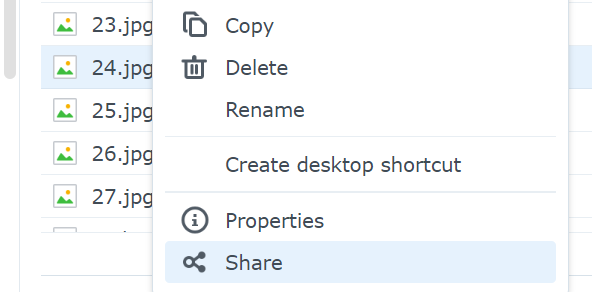

### 5. その他機能(仮想化系)

1. Docker コンテナの運用 ([Container Manager](https://www.synology.com/dsm/feature/container-manager))
2. Windows や Linux のバーチャルマシンの運用 ([Virtual Machine Manager](https://www.synology.com/dsm/feature/virtual_machine_manager))

#### 応用例

- Windows で時間がかかる処理を、NAS のバーチャルマシンで行う
- 社内ツールの Web サーバー・SQL サーバーとしての利用
- [PhotoPrism](https://www.photoprism.app/)のサーバーとして運用
  - ミラーレスカメラで撮影 → FTP で 直接 NAS にアップロード → PhotoPrism で管理

<!-- PhotoPrismを例に、Dockerの活用について説明 -->

### Mac Mini サーバー ([Mac Mini (M2)](https://www.apple.com/jp/mac-mini/))

10GbE オプションの Mac Mini (M2) を 2 台導入

ラックマウント化し、ディスプレイなしで運用(Parsec でリモートアクセス)

#### 導入のきっかけ

- Mac 環境はやっぱり手元に欲しい
  - たまに送られてくる Mac フォーマット(HFS+)の HDD への対応
  - ソフトウェアの動作検証がしたい
  - 常時起動のサーバーとして運用してみたい
- Mac Mini だけコストパフォーマンスが異常
  - 当時 10 万円を切っていた

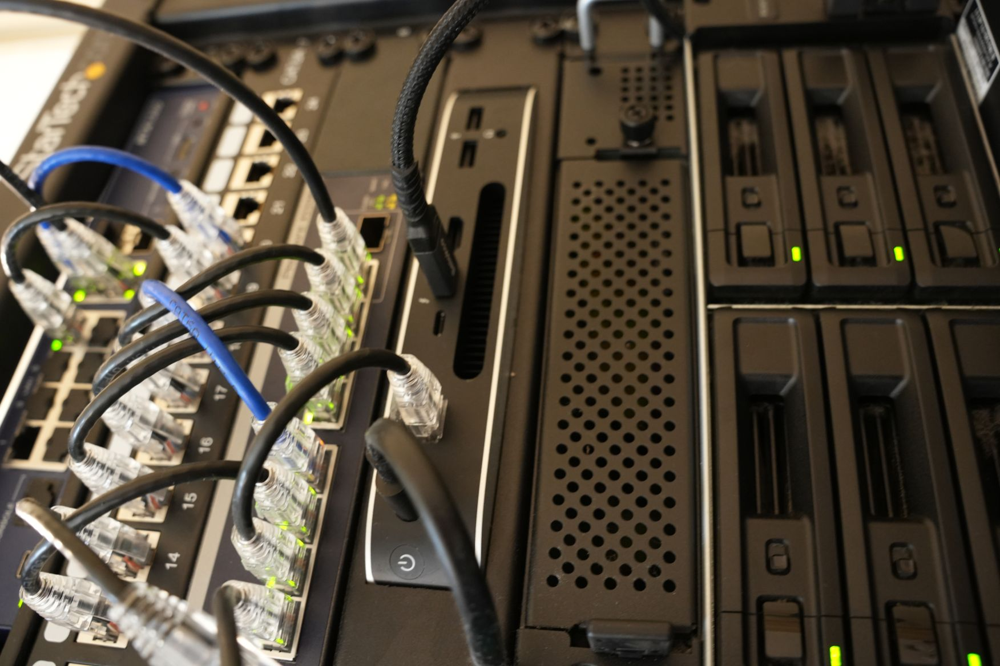

### Mac Mini 1 台目

安定動作が期待される**サーバー機能**を集約

- Docker コンテナの運用
  - [Kollaborate](https://www.kollaborate.tv/) のサーバー
- [OpenVPN](https://openvpn.net/) サーバー(運用休止中)
- [DaVinci Resolve](https://www.blackmagicdesign.com/jp/products/davinciresolve/) の **データベースサーバー**
- [Team Render](https://www.maxon.net/ja/cinema-4d/features/network-rendering) の **サーバー**


### Mac Mini 2 台目

Mac 環境必須のアプリケーションなどを実行

- Mac 環境でのツールなどの検証
- Thunderbolt 接続された LTO ドライブへのアクセス
- DaVinci Resolve でのリモート ProRes レンダリング


### リモートデスクトップ環境 ([Parsec](https://parsec.app/))

- リモートデスクトップで、運用しているマシンにアクセス可能
- ラックマウントの Mac へもリモートアクセスで、KVM 的に使う
- 遅延が小さく、広色域・固定フレームレートにも対応していて、映像作業にも使える
- [Chrome Remote Desktop](https://remotedesktop.google.com/) も併用して二重化している

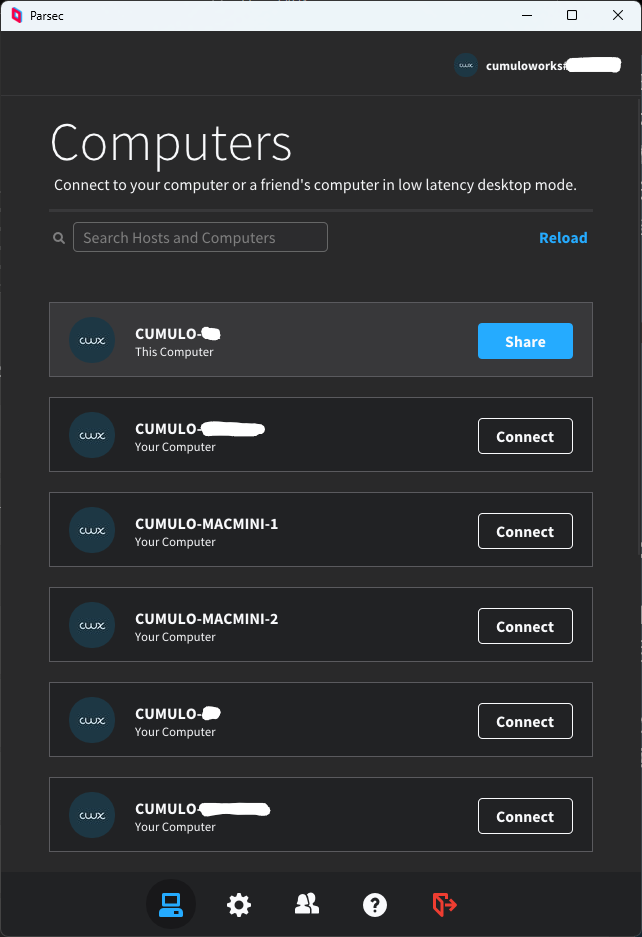

### メインマシン

- 2024 年始めに導入した Threadripper マシン
  - AE での編集作業がストレスなく行えるように、メモリを 384GB に
- 現状 VRAM が 24GB で足りないので、将来的に換装予定

  ```plaintext
  CPU: AMD Ryzen Threadripper 7980X
  M/B: ASUS Pro WS TRX50-SAGE WIFI
  GPU: MSI GeForce RTX 4090 SUPRIM LIQUID X
  RAM: Kingston 384GB (4x DDR5-5600 RDIMM ECC 96GB Micron Die)
  SSD: 2x Nextorage 2TB NVMe SSD PCIe Gen5x4
  PSU: SUPERFLOWER LEADEX VII GOLD 1300W
  CPU_FAN: Arctic Freezer-4U-M
  CHA: Geometric Future Model 4 Caliburn
  CHA_FAN: 3x Thermaltake TOUGHFAN 12 Pro
  ```

  

### レンダリングマシン

- 以前まで使っていた水冷のメインマシンを小型化したもの
- 電力的なコストパフォーマンスは悪いが、まだまだ現役
- 見た目がかなり気に入っている、史上最高傑作

  ```plaintext
  CPU: AMD Ryzen 9 5950X
  M/B: MSI Prestige X570 Creation
  GPU: 2x Zotac GeForce RTX 3090 Trinity
  RAM: Kingston 384GB (4x DDR5-5600 RDIMM ECC 96GB Micron Die)
  SSD: Corsair Force Series MP600
  PSU: SUPERFLOWER LEADEX VII GOLD 1300W
  CHA: Jonsbo TK-1 White
  CHA_FAN: 2x Noctua NF-F12 industrialPPC-3000 PWM
  CHA_FAN: 2x Noctua NF-A12X15
  WATER COOLING: EKWB
  ```

  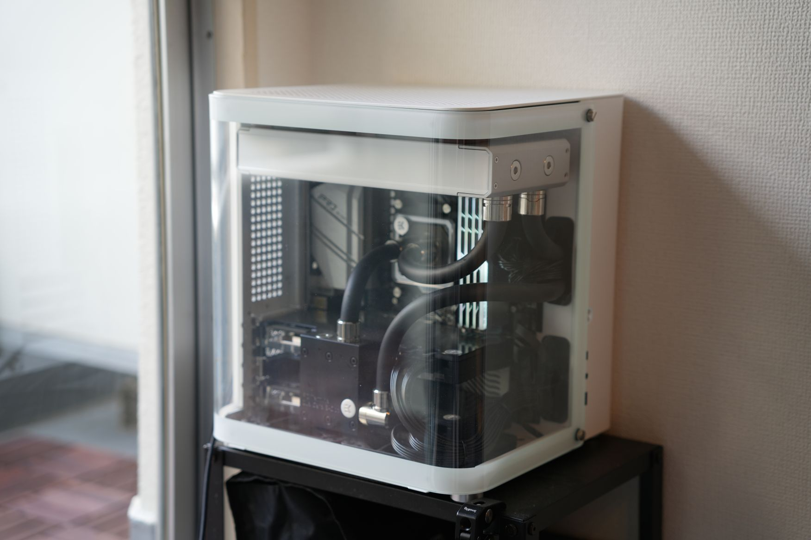
  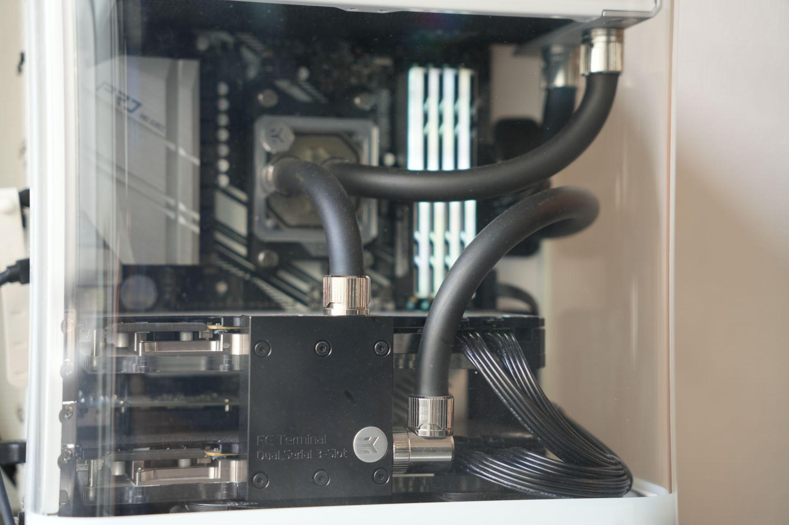

## ワークフロー

### 進行管理・コミュニケーションツール

- 社内では基本的に [Notion](https://www.notion.so/), [Discord](https://discord.com/) に集約
- Discord は、チャンネルごとに細かい権限設定が出来て、複数プロジェクトが同時に動くような状況でも使いやすい
- その他、プロジェクトに合わせて柔軟に対応

### ファイルの命名規則・整理のルールなど

- すべてのプロジェクトでファイルの命名規則を統一
- 最近、ルールを明文化した[Github で公開中](https://github.com/cumuloworks/public-docs/blob/main/cumuloworks-naming-standard.md)

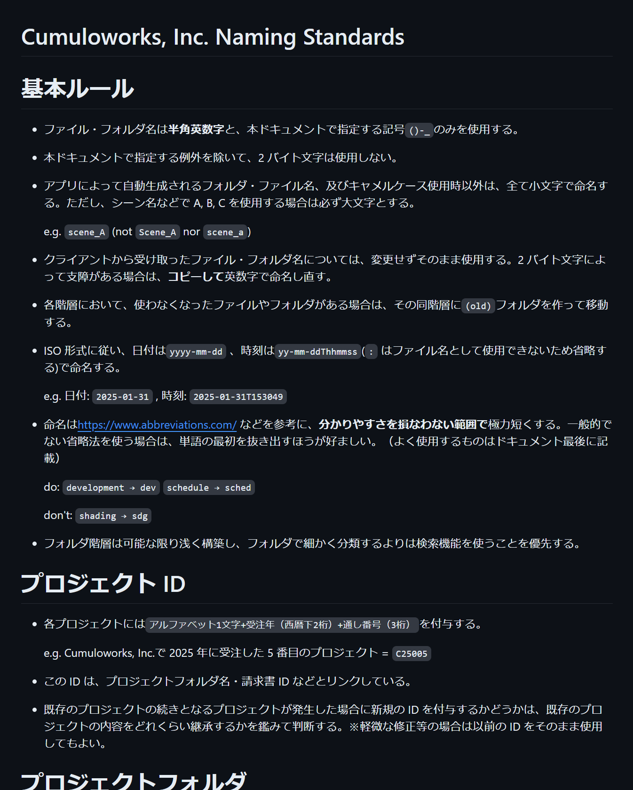

### カラーマネジメント

- ハードウェアキャリブレーション可能なモニターを導入
- 最近では、ACES への統一を進めている
- After Effects の新しい OCIO 機能も活用している

#### 各ソフトウェアのカラースペース

- Octane Render: ACEScg
- After Effects: ACEScg でコンポジット、ACEScct で書き出し
- DaVinci Resolve: ACEScct
- 納品: 基本的には Rec.709 で、必要に応じて他のカラースペースに変換

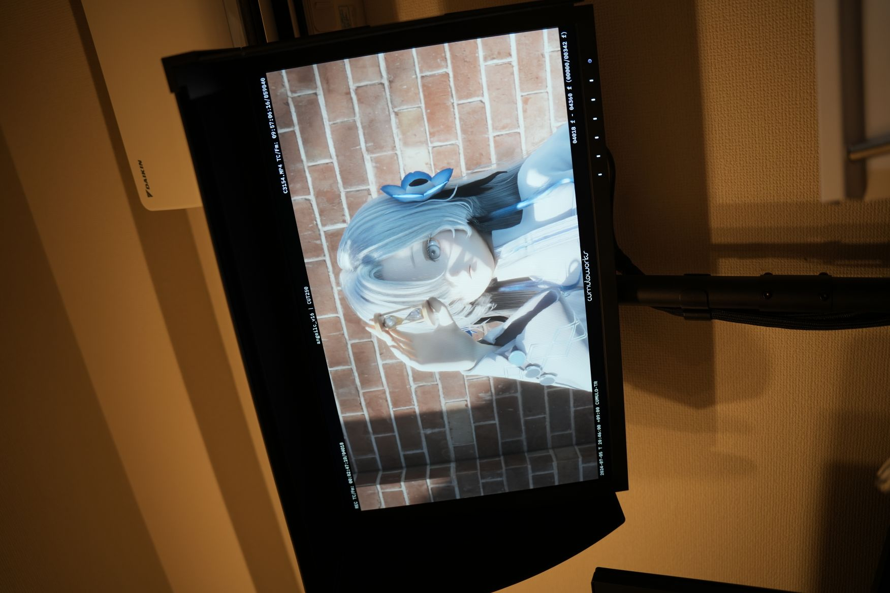

### After Effects でタイムコードのオーバーレイの作成

- 各ショット・フレームを正確に把握するために独自のオーバーレイを導入
- 日時・マシン名・タイムコードなどがすぐ把握でき、CG ソフトとのやり取りや、エラーフレームの除去などで活用
- プレビズやオフラインデータを起点として制作する場合、特に有用
- 16:9 の上下に余白を作る形で挿入している


### <!-- 図拡大 -->

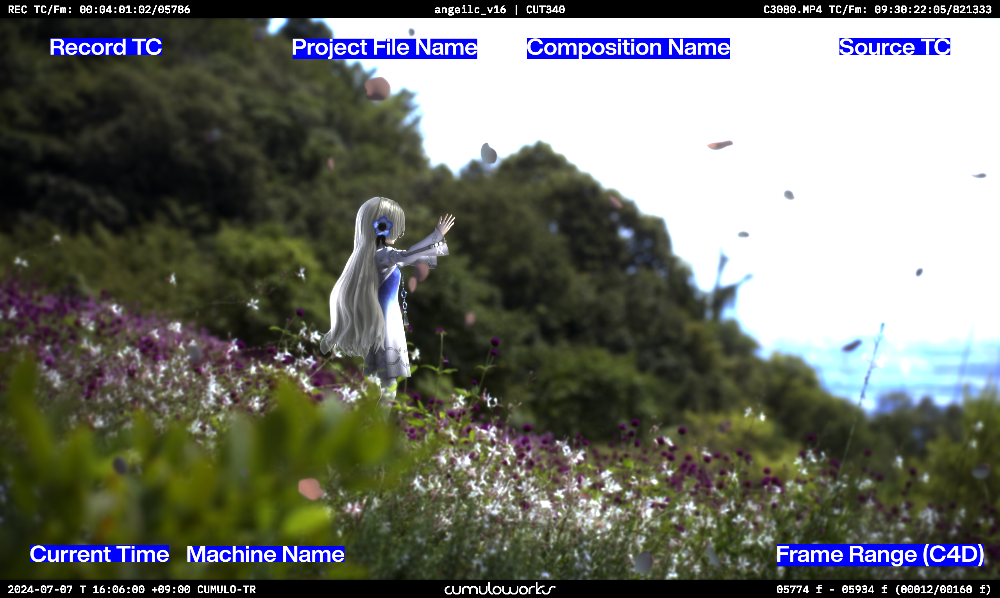

### スプレッドシートでカットの情報を一元管理する

- オーバーレイと同時に、スプレッドシートで各ショットの進捗状況を把握
- 複数人で作業する際に効果を発揮（レンダリング作業の分担など）

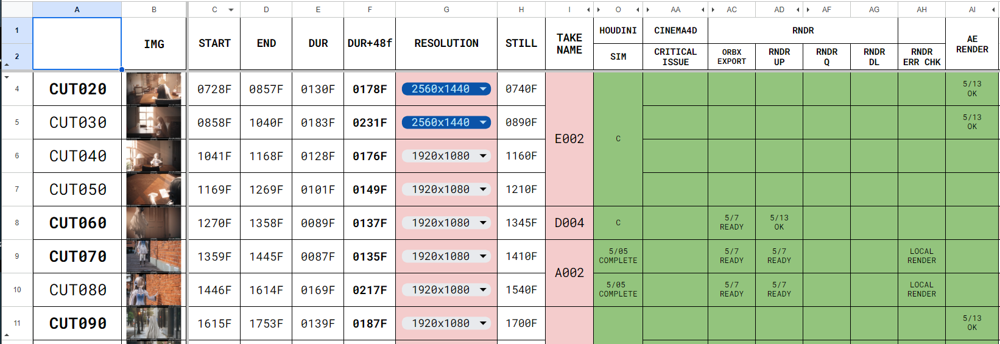

### レビューシステム

Docker で動作する [Kollaborate](https://www.kollaborate.tv/) を導入

- オンプレミスで動く frame.io みたいな
- レビューのコメントを DaVinci Resolve と EDL で連携
- クライアントとの共有でも有用

### <!-- レビューシステム 写真 -->

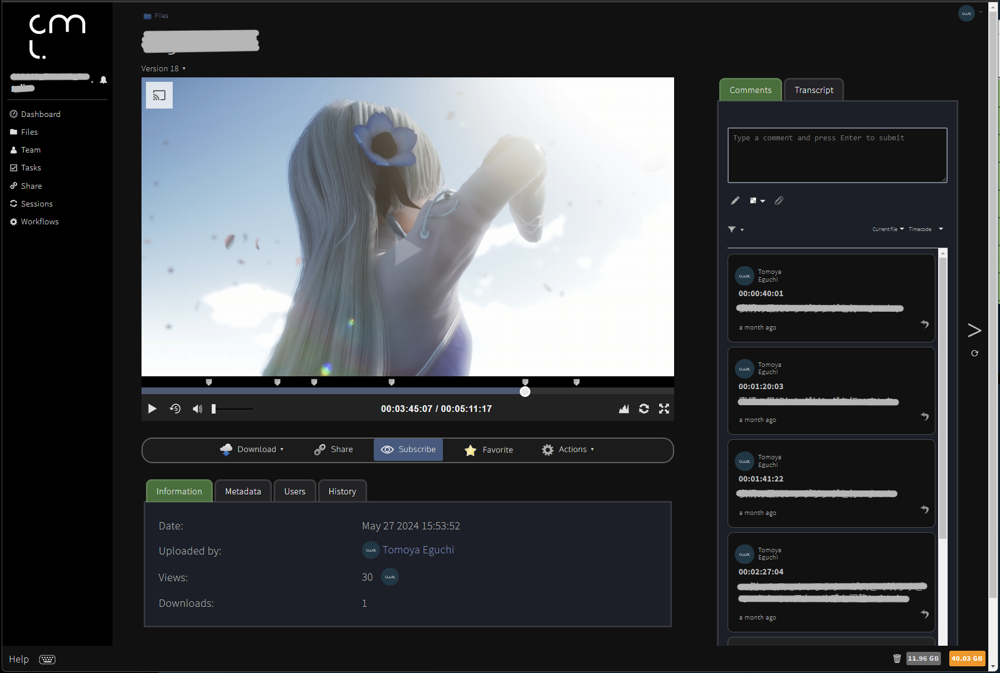

### CG レンダリング

#### GPU (Octane Render)

- ほぼ全てのプロジェクトで Octane Renderer を使用
- 基本的には [RNDR](https://rndr.otoy.com/) を使用したクラウドレンダリング
- プレビューや、短時間のレンダリングは Render Node を使用
- それぞれのマシンの GPU をネットワーク経由で利用可能簡単にスケールできる

#### CPU (Cinema 4D Standard など)

- Cinema 4D の Team Render を使用することも

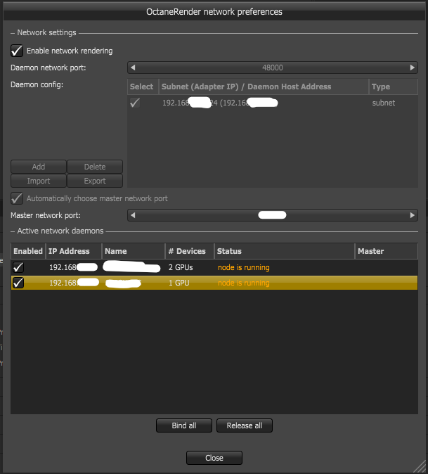

### 編集・納品

- 編集は主に DaVinci Resolve を使用
- Mac Mini サーバーで運用中のデータベースサーバーを使って、複数人でタイムラインを共有できる
- Mac でリモートレンダリングを設定することで、Windows マシンから ProRes でレンダリングできる

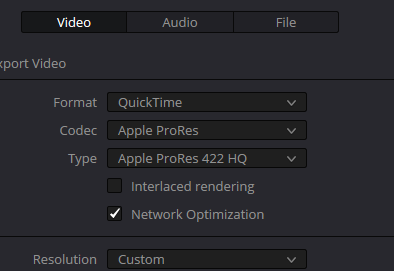

## バックアップ体制

### バックアップの考え方

データの削除は行わず、永続的に保存することを基本方針としている

ファイルを 3 つのカテゴリに分けて考える

1. 進行中のプロジェクト
2. 終了直後のプロジェクト
3. 終了して一定期間が経過したプロジェクト

### 1. 進行中のプロジェクト

- メインサーバーの HDD は、RAID6（SHR-2）で構成され、2 つのディスク障害に耐えられる
- メインサーバーの障害時に備え、オフサイトサーバーにリアルタイムでバックアップを取る
- プロジェクトが長期化する場合は、定期的に LTO-8 テープにバックアップを取る

```plaintext
参考: 3-2-1 ルール

- 3 つのコピー (e.g. メインサーバー + オフサイトサーバー + LTO-8 テープ)
- 2 つの異なるメディア (e.g. HDD + LTO-8 テープ)
- 1 つのオフサイト (e.g. オフサイトバックアップサーバー, LTO-8 テープは分散保管)
```

### オフサイトバックアップサーバー ([Synology DS1618+](https://www.synology.com/ja-jp/products/DS1621+))

- メインサーバー導入前に使用していた 6 ベイ NAS を流用(40TB)
- 進行中のプロジェクトなど、重要なデータをメインサーバーとリアルタイム同期
- メインサーバーが使えない状況でも最低限のデータにアクセスできるようにしている

```plaintext
Intel Atom C3538 4-core 2.1 GHz
RAM: 16GB DDR4 ECC UDIMM

6x 8TB WD Red
```

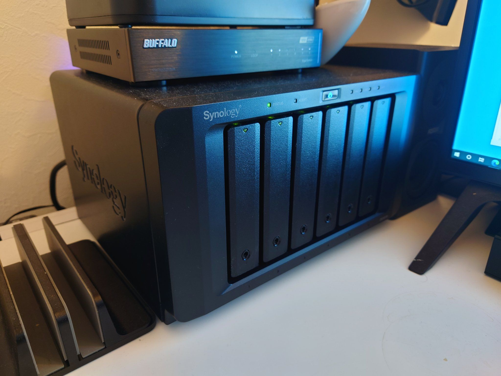

### 2. 終了直後のプロジェクト (ホットアーカイブ)

- 終了直後のプロジェクトは容量が許す限りは、メインサーバーで保存
- オフサイトサーバーにバックアップする代わりに、LTO-8 テープにバックアップを取る
- 完パケの動画ファイルのみ別途フォルダに保存し、いちいち LTO からリトリーブする必要が無いようにしている

### 3. 終了して一定期間が経過したプロジェクト (コールドアーカイブ)

- 終了して一定期間が経過したプロジェクトは、メインサーバーから削除
- LTO-8 テープのコピーを 2 つ作り、別々の場所に保管する

### LTO について

- LTO は磁気テープ型のデータストレージで、HDD と比べて耐久性が高く、データの保存期間も長い
- 頻繁なアクセスが必要なデータには向かないが、アーカイブ用途には適している
- 完全にオフラインで保存することができるため、ランサムウェアなどのセキュリティ対策としても有効と思われる

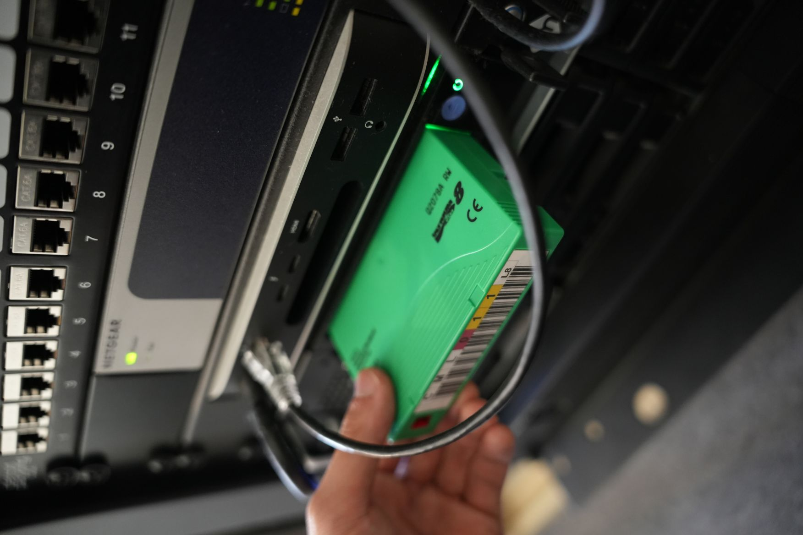

### LTO の使用方法・メンテナンスなど

- LTO の保存条件は、温度・湿度・磁気の影響を受けやすいため、適切な環境で保管する必要がある
- 温度は、基本的な日本の屋内であれば問題ないが、湿度が高い部屋の場合はドライボックスなどを使用するのが良さそう
- データが消える程の磁気の影響は、普段の生活では問題ないと思われる
- クリーニングカートリッジというのがあり、ドライブでクリーニングのサインが点灯した段階で使用する
- 災害などへの対策として、同一のコピーを 2 つ作成、別々の場所で保管する

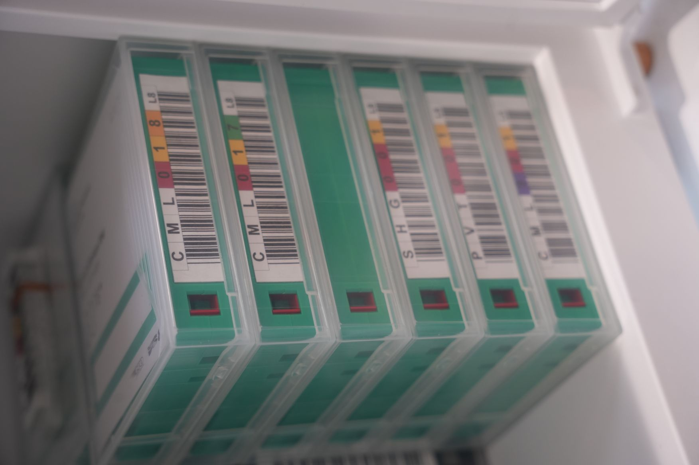

### LTO 検索システム

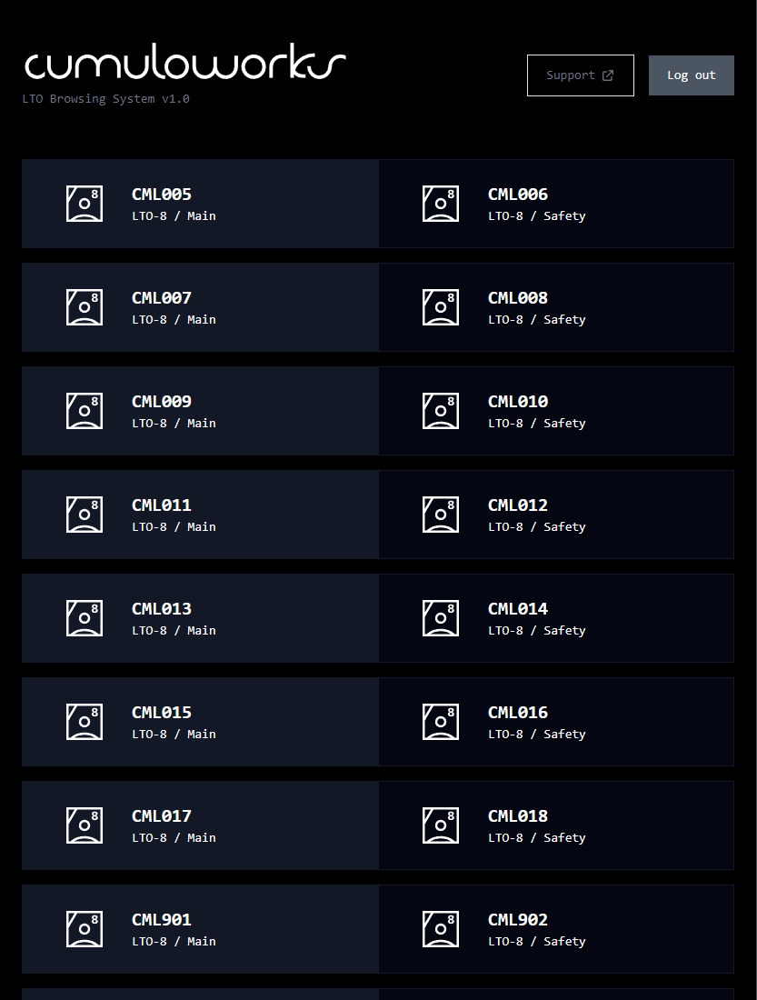

- [YoYotta](https://yoyotta.com/) を使用してアーカイブ・リトリーブ操作を行う
- YoYotta は、データ検索が若干遅い
- データコピーのログを SQL に登録して、ブラウズできるサービスを制作
- Next.js たのしい

### LTO のコストパフォーマンス

- LTO は、ドライブが非常に高価だが、テープは安価
- 一度導入してしまえば、以降テープの購入費用だけで済み、長期的に高いコストパフォーマンス
- Amazon の Glacier などのクラウドストレージでは、保存しているデータ量のみならず、データのアップロード・ダウンロードにコストがかかる
- [計算 by ChatGPT (python)](python/lto_calculator.py)
  `150TB + 毎年 40TB 増加 + 10 年間保存`

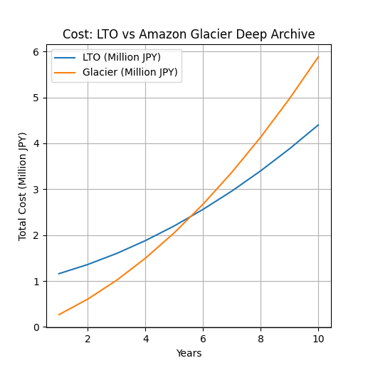

### 今からできる!バックアップストラテジー

- 重要なデータはクラウドストレージで同期を取る

  - ローカルのドライブの障害に備える

- HDD は、2 つ以上のコピーを作る
  - 可能であれば、1 つはオフサイトに保管する(自宅 + 職場など)

### バックアップ体制のまとめ

| 進行中                         | 終了直後       | 終了後       |
| ------------------------------ | -------------- | ------------ |
| メインサーバー                 | メインサーバー | LTO-8 テープ |
| オフサイトサーバー             | LTO-8 テープ   | -            |
| LTO-8 テープ(長期プロジェクト) | -              | -            |

## 今後の展望 (最近興味があること)

### <!-- dummy header -->

#### アプリケーション開発 (Python, Node.js)

- 開発中のアプリケーション[（Seequer）](https://seequer.app/)
- 連番ファイルの一覧表示、プレビュー、破損ファイル検出など

  <!-- 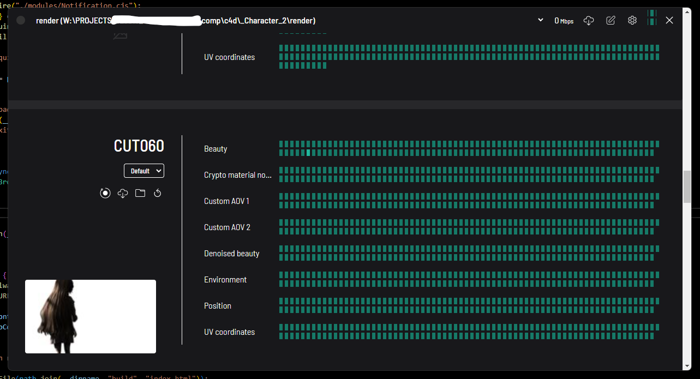 -->

#### カットごとにリアルタイムで進捗状況をトラッキングすること

- フライトストリップでの管理?
- 専用のアプリケーション開発?


#### git でのバージョン管理

- 複数人で作業するとき、データをバージョン管理できないか（特に AEP など）?
- 複数の AEP、複数のコンポジションなどを複数人で作業した後にマージする方法はないか?

### 興味がある方、是非ご連絡ください

アイデア交換や共同開発など...勉強させてください

## ありがとうございました

<center>
Thank you very much for listening!
</center>

### ご質問などがあればお気軽にどうぞ


本講演の資料は [Github で公開しています](https://cumuloworks.github.io/public-vgt2024/Vook%20VGT%202024.html)

[](https://github.com/cumuloworks) [](https://twitter.com/cumuloworks) [](https://www.instagram.com/cumuloworks/) [](https://marshmallow-qa.com/cumuloworks)

## Q&A

### 質問です。クラウドに関して、Google drive からオンプレではなく Flame.io に移行することは検討されなかったのでしょうか？また、それはなぜですか？

📌 データが映像関連のみでないことと、今後 200TB 以上にデータが膨れ上がることを想定すると、frame.io のようなクラウドサービスを使い続けることは現実的ではないと判断しました

### NAS のバーチャルマシンとして使う具体例お聞きしたいです！メインマシンの方がパワーがあるのでは？と疑問でした。ファイル管理などで Windows では不向きな面があるのでしょうか？

📌 負荷が高い作業というよりは、**負荷が低いが時間がかかる作業**を回すことが多いです。それらをメインマシンで行うと、再起動などによっていちいち中断されてしまうからです

e.g. 遅いサーバーからのデータのダウンロードや、時間がかかるファイルの変換処理など
