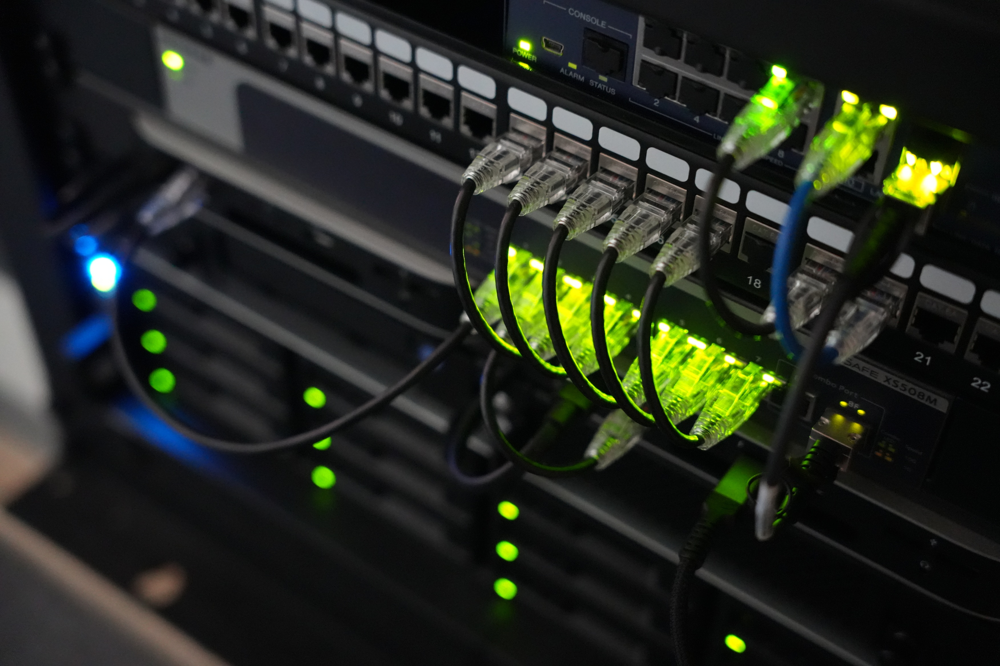
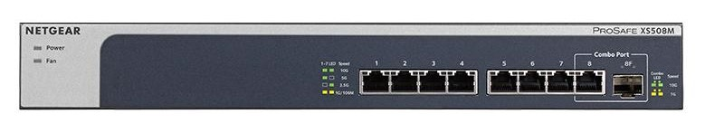
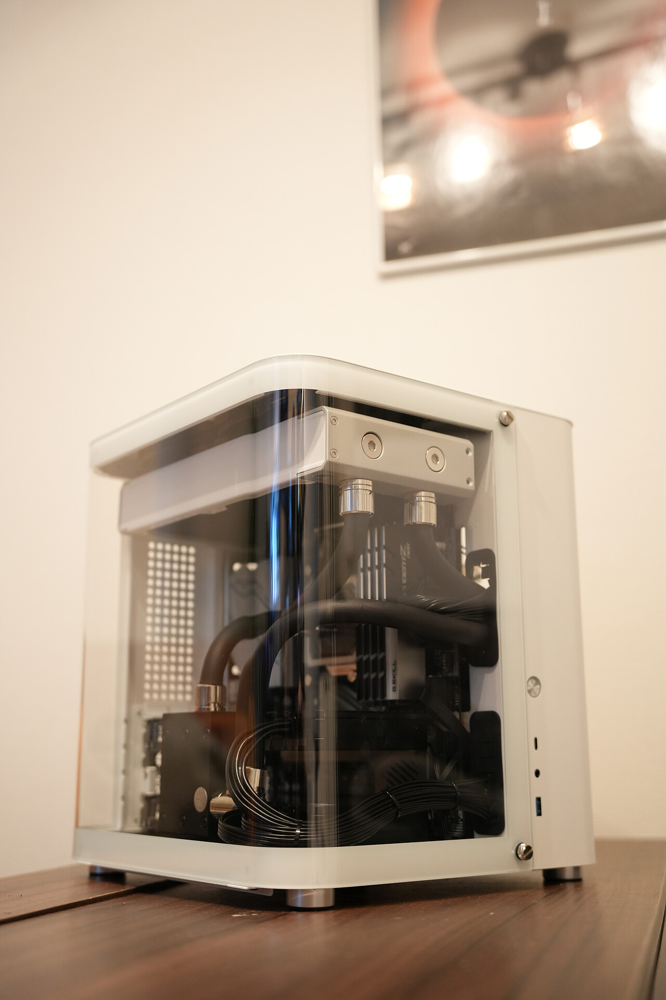
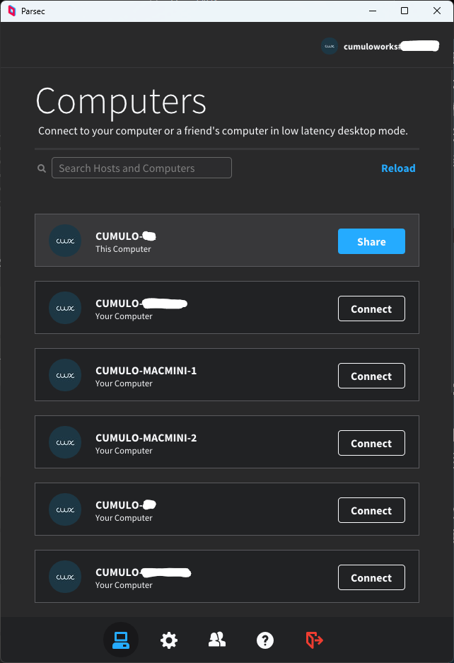
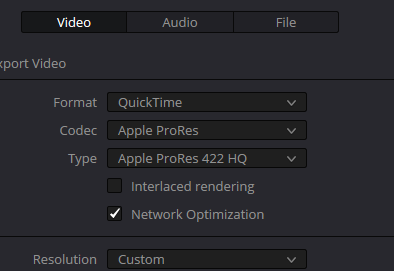

# 快適な制作環境の作り方




# 自己紹介

## Tomoya Eguchi (Cumuloworks)

**Freelance Director**
Motion Designer, CG Generalist
最近ちょっと Developer

<hr>

- 2014 年 映像制作を始める
- 2017 年 大学に通いながらフリーランスに
- 2018 年 株式会社ナナメ 入社
- 2020 年 退社、独立してフリーランスに
- 2021 年 法人化

<!-- 最近は、会社として映像制作 -->


## 合同会社キュムロワークス

Cumuloworks, Inc.
2021 年 9 月設立 (もうすぐ 4 期目)

> 広告・エンタメの CG 映像制作がメイン
> 6 月からは[@shigu](https://twitter.com/shgumo)との 2 名体制

> [SHOWREEL 2024](https://cumulo.works/)


## [SHOWREEL 2024](https://cumulo.works/)

<video src="assets\Cumuloworks_SHOWREEL2024_vgt.mp4" controls ></video>

## <!-- 最近のWORK -->


# 本日の内容

<center>

#### 1. 機材紹介

Cumuloworks が導入している機材の紹介

#### 2. ワークフロー紹介

機材をどのように制作に活かしているか

#### 3. 今後の展望

最近興味があること、今後の拡張の計画（妄想）

</center>

# 機材紹介

## ラック ([StarTech 4POSTRACK8U](https://www.startech.com/ja-jp/server-management/4postrack8u))

2023 年に導入したラック。

- 奥行きを調整できるタイプで、高さは 8U。
- デスク周りに機材が散らばらず、コンパクトに収まる。
- ⭕ 見た目がクール ❌️ あらゆる付属品の価格が高い

  

## ラック構成

<center>


</center>

## メインルーター ([YAMAHA RTX1300](https://network.yamaha.com/products/routers/rtx1300/))

**NTT 光クロス(10Gbps)** を引き込んでおり、スイッチを介して分配される。

- ⭕️ NTT のレンタルルーター([XG-100NE](https://web116.jp/shop/hikari_r/xg_100ne/xg_100ne_00.html))よりも高い安定性。
- 高スループットの回線を契約することにより、データのやり取りでストレスが減った。
- インターネットに直に接する機材 → セキュリティ面で重要な役割。
- Mac アドレスを基に、主要な LAN 内デバイスの IP アドレスをルーター側で固定。

## メインスイッチ ([NETGEAR XS508M](https://www.netgear.com/jp/business/wired/switches/unmanaged/xs508m))

8 ポートのシンプルな **オール 10GbE** スイッチ。

- 排熱も良好で、本格的に 10GbE 化を始めたい方にはおすすめ。
- ここから各作業用マシン・サーバーなどへネットワークが分配される。
- 8 ポートで足りず、買い替えを検討中。

<br>



## UPS ([OMRON BN75R](https://socialsolution.omron.com/jp/ja/products_service/ups/product/bn75-300r/bn75-300r.html))

ラック全体の電源をバックアップする、最大 680W 対応の UPS。

- 現環境の高負荷時で、10 分程度は電力を維持可能。
- NAS と USB 接続することで、電力喪失時に安全にシャットダウンされる。
- 商用電源が不安定になっても、安全に電力供給できる（見落とされがちなメリット）。
  - 電力逼迫で、電圧低下や周波数不安定化が起こることは今後もありそう。
- ⭕️ 前面の液晶ディスプレイで、電力消費量やバッテリー残量などが確認できて便利。


## ネットワーク構成

#### ポイント

- すべて 10GbE 接続
- 10GbE スイッチを介して相互接続
- NAS は 20GbE 帯域を確保
  - 理論上、Internet <-> NAS と、各マシン <-> NAS それぞれで 10Gbps の帯域を確保。


## メインストレージサーバー ([Synology RS3621xs+](https://www.synology.com/ja-jp/products/RS3621xs+))

すべてのデータが集約される **200TB**のメインサーバー。
ストレージサーバー以外の機能も持たせている。

- すべての作業用ファイル・アセットなどを集約。
  - ファイルの権限設定
  - アクセスログ
  - バージョン履歴の保存
- 社内ツールの Web サーバーとしての利用。
- Docker コンテナを走らせたり。
- 各作業マシンのシステムイメージのバックアップを取っている。


## オフサイトバックアップサーバー ([Synology DS1618+](https://www.synology.com/ja-jp/products/DS1621+))

- メインサーバー導入前に使用していた 6 ベイ NAS を流用。
- アクティブなプロジェクトやその他クリティカルなアセットをメインサーバーとリアルタイム同期
- メインサーバーが使えない状況でも最低限のデータにアクセスできるようにしている

## Mac Mini サーバー ([M2 Mac Mini](https://www.apple.com/jp/mac-mini/))

- 10GbE オプションの M2 Mac Mini を 2 台ラックマウントで導入。
- 2 台を異なる用途で運用。


#### Mac Mini 1 台目

安定動作が期待されるサーバー機能を集約

- Docker コンテナで運用している社内ツールを運用
- [Kollaborate](https://www.kollaborate.tv/) のサーバー
- [OpenVPN](https://openvpn.net/) サーバー(運用休止中)
- DaVinci Resolve のデータベースサーバー

#### Mac Mini 2 台目

Mac 環境必須のアプリケーションなどを実行

- Mac 環境でのツールなどの検証
- Thunderbolt 接続された LTO ドライブへのアクセス
- DaVinci Resolve でのリモートレンダリング

## メインマシン

- 2024 年始めに導入したメインマシン。After Effects や DaVinci Resolve での作業がストレスなく行えるように、メモリを 384GB に。
- Cinema 4D などでのシミュレーション作業も高速で行えるように Ryzen Threadripper にした。現状 VRAM が 24GB で足りないので、将来的に換装予定。

  ```
  CPU: AMD Ryzen Threadripper 7980X
  M/B: ASUS Pro WS TRX50-SAGE WIFI
  GPU: MSI GeForce RTX 4090 SUPRIM LIQUID X
  RAM: Kingston 384GB (4x DDR5-5600 RDIMM ECC 96GB Micron Die)
  SSD: 2x Nextorage 2TB NVMe SSD PCIe Gen5x4
  PSU: SUPERFLOWER LEADEX VII GOLD 1300W
  CPU_FAN: Arctic Freezer-4U-M
  CHA: Geometric Future Model 4 Caliburn
  CHA_FAN: 3x Thermaltake TOUGHFAN 12 Pro
  ```

  

## レンダリングマシン

- 2024 年まで使っていた水冷マシンを小型化したもの。
- 電力的なコストパフォーマンスは悪いが、まだまだ現役。

  ```
  CPU: AMD Ryzen 9 5950X
  M/B: MSI Prestige X570 Creation
  GPU: 2x Zotac GeForce RTX 3090 Trinity
  RAM: Kingston 384GB (4x DDR5-5600 RDIMM ECC 96GB Micron Die)
  SSD: Corsair Force Series MP600
  PSU: SUPERFLOWER LEADEX VII GOLD 1300W
  CHA: Jonsbo TK-1 White
  CHA_FAN: 2x Noctua NF-F12 industrialPPC-3000 PWM
  CHA_FAN: 2x Noctua NF-A12X15
  ```

  

## リモートデスクトップ環境 ([Parsec](https://parsec.app/))

- リモートデスクトップで、運用しているマシンにアクセス可能。
- ラックマウントの Mac へもリモートアクセスで、KVM 的に使う。
- 遅延が小さく、広色域・固定フレームレートにも対応していて、映像作業にも使える。
- [Chrome Remote Desktop](https://remotedesktop.google.com/) も併用して二重化している。



# ワークフロー紹介

## 進行管理・コミュニケーション

- 社内では基本的に [Notion](https://www.notion.so/), [Discord](https://discord.com/) に集約。
- プロジェクトに合わせて柔軟に対応

## ファイルの命名規則・整理のルールなど

- GitHub で、社内での命名規則のルールを明確化
- 公開中なので、参考にしてほしい

## レンダリングワークフロー

- WIP

## After Effects でタイムコードのオーバーレイの作成

- プレビズやオフラインデータを起点として制作する場合、各ショット・フレームを正確に把握するために独自のオーバーレイを導入
- 日時・マシン名・タイムコードなどがすぐ把握でき、CG ソフトとのやり取りや、エラーフレームの除去などで活用


## Nobe Omniscope + NDI でスコープの表示

## スプレッドシートでカットの情報を一元管理する

- オーバーレイと同時に、スプレッドシートで各ショットの進捗状況を把握
- 複数人で作業する際に効果を発揮（レンダリング作業の分担など）

## GPU レンダリング

- 殆ど全てのプロジェクトで Octane Renderer を使用。
- 基本的には RNDR ネットワークを使用したクラウドレンダリング
- プレビューや、短時間のレンダリングは、ローカルのネットワークレンダリングで行う
- Octane Render の Render Node をつなげることで、それぞれのマシンの GPU を利用可能。簡単にスケールできる

## CPU レンダリング

- Octane Render 以外でのレンダリングは、Cinema 4D の Team Render を使用

## 編集・納品

- 編集は主に DaVinci Resolve を使用。
- Mac Mini サーバーで運用中のデータベースサーバーを使って、複数人でタイムラインを共有できる。
- Mac でリモートレンダリングを設定することで、Windows マシンから ProRes でレンダリングできる。



# プロジェクトのアーカイブ

## ホットアーカイブ

- 直近のプロジェクトは容量が許す限りメインサーバーで保存。
- 完パケの動画ファイルのみ Kampakes フォルダに保存し、後述の LTO からリトリーブする必要が無いようにしている。

## コールドアーカイブ

- 2024 年始め、LTO-8 ドライブを導入。Thunderbolt 接続で、Mac Mini サーバーで運用している。
- YoYotta を使用してアーカイブ・リトリーブ操作を行い、出力された CSV データを SQL データベースに登録、Web サイトからユーザーごとに参照できるようにしている。

## アーカイブのカテゴライズ

| 進行中のデータ                 | 直近のデータ   | 1 年以上経過したデータ |
| ------------------------------ | -------------- | ---------------------- |
| メインサーバー                 | メインサーバー | LTO-8 テープ           |
| オフサイトバックアップサーバー | LTO-8 テープ   | -                      |

## LTO について


### LTO とは。LTO と HDD の違い。

- LTO はテープ型のデータストレージで、HDD と比べて耐久性が高く、データの保存期間も長い。
- 頻繁なアクセスが必要なデータには向かないが、アーカイブ用途には適している。
- 完全にオフラインで保存することができるため、ランサムウェアの対策としても有効と思われる

### LTO のコストパフォーマンスについて

- LTO は、ドライブが非常に高価だが、テープは安価。
- 一度導入してしまえば、以降テープの購入費用だけで済み、長期的に高いコストパフォーマンス。
- Amazon の Glacier などのクラウドストレージでは、保存しているデータ量のみならず、データのアップロード・ダウンロードにコストがかかる。

### 使用方法・メンテナンスなど

- LTO の保存条件は、温度・湿度・磁気の影響を受けやすいため、適切な環境で保管する必要がある。
- 温度は、基本的な日本の屋内であれば問題ないが、湿度が高い部屋の場合はドライボックスなどを使用するのが良さそう。
- データが消える程の磁気の影響は、普段の生活では問題ないと思われる。
- クリーニングカートリッジというのがあり、ドライブでクリーニングのサインが点灯した段階で使用する。
- 災害などへの対策として、同一のコピーを 2 つ作成、別々の場所で保管する。

# まとめ

## なぜオンプレミス化を進めるのか？

- ハードウェアをいじるのが面白いから
- ラックマウントがかっこいいから
- 第三者サービスへの依存を軽減するため...突然のサービス中止、内容変更など

## 機材の選定はどうやって行う？

- コストパフォーマンスを、どのように比較するか
- データ損失などへのリスクをどう評価するか

# 今後の展望 (最近興味があること)

## アプリケーション開発 (Python, Node.js)

- 開発中のアプリケーション（Seequer）のデモ

## カットごとにリアルタイムで進捗状況をトラッキングすること

カットリストの作成
フライトストリップでの管理など

## git でのバージョン管理

複数人で作業するとき、データをバージョン管理できないか（特に AEP など）
