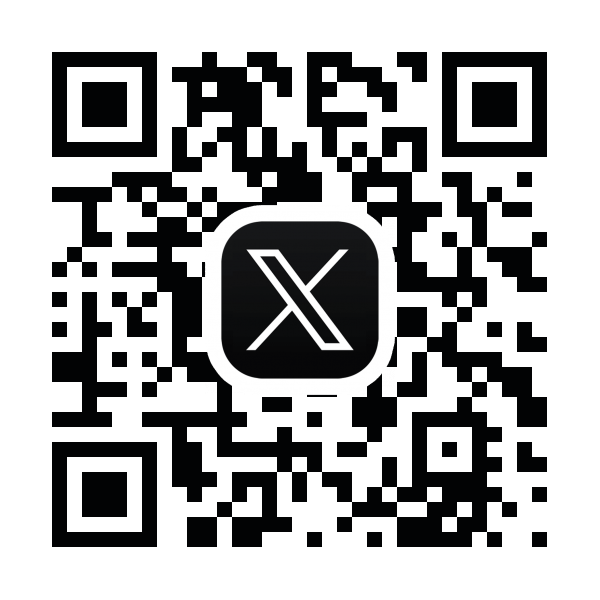
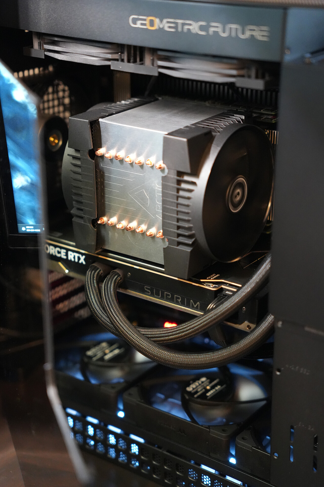
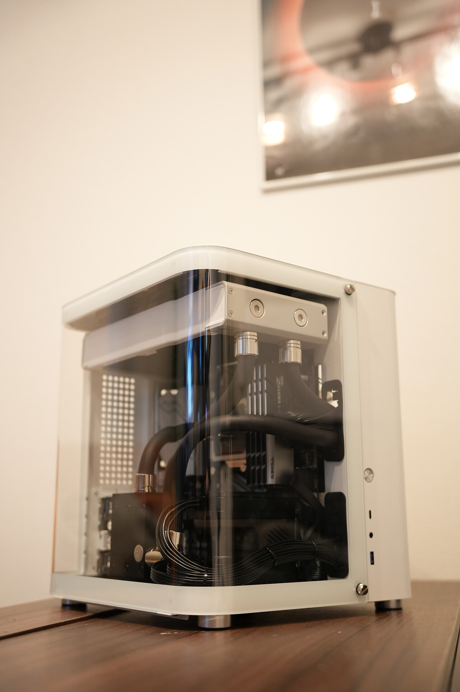

# 快適な制作環境の作り方


# 自己紹介

## Tomoya Eguchi

合同会社キュムロワークス 代表
Freelance Director
Motion Designer, CG Generalist
最近ちょっと Developer

> 2014 年 映像制作を始める
> 2017 年 大学に通いながらフリーランスに
> 2018 年 株式会社ナナメ 入社
> 2020 年 退社、独立してフリーランスに
> 2021 年 法人化



## 合同会社キュムロワークスについて

Cumuloworks, Inc.
2021 年 9 月設立

> 広告・エンタメ映像など幅広く制作。
> 7 月からは[@shigu](https://twitter.com/shgumo)との 2 名体制。


## [SHOWREEL 2024](https://cumulo.works/)

<video src="https://file.cumulo.works:48162/content/media/2024/07/Cumuloworks_SHOWREEL2023_v1.mp4" controls></video>

# 機材紹介

## メインルーター ([YAMAHA RTX1300](https://network.yamaha.com/products/routers/rtx1300))

- NTT 光クロス(10Gbps)を引き込んでおり、スイッチを介して分配される。
- 高スループットの回線を契約することにより、データのやり取りでストレスが減った。

## メインスイッチ ([NETGEAR XS508M](https://www.netgear.com/jp/business/wired/switches/unmanaged/xs508m))

- 8 ポートのシンプルな 10GbE スイッチ。
- 排熱も良好で、本格的に 10GbE 環境を構築したい方にはおすすめ
- ここから各作業用マシン・サーバーなどへネットワークが分配される。

## メインサーバー ([Synology RS3621xs+](https://www.synology.com/ja-jp/products/RS3621xs+))

- すべての作業用ファイル・アセットなどを集約。
- 社内ツールの Web サーバーとしての利用
- Docker コンテナを走らせたり

## オフサイトバックアップサーバー ([Synology DS1618+](https://www.synology.com/ja-jp/products/DS1621+))

- メインサーバー導入前に使用していた 6 ベイ NAS を流用。
- アクティブなプロジェクトやその他クリティカルなアセットをメインサーバーとリアルタイム同期
- メインサーバーが使えない状況でも最低限のデータにアクセスできるようにしている

## Mac Mini サーバー ([M2 Mac Mini](https://www.apple.com/jp/mac-mini/))

- 10GbE オプションの M2 Mac Mini を 2 台ラックマウントで導入。

### Mac Mini 1 台目

安定動作が期待されるサーバー機能を集約

- オンプレミス動画レビューサービスのサーバー
- VPN サーバー（運用休止中）
- DaVinci Resolve のデータベースサーバー

### Mac Mini 2 台目

Mac 環境必須のアプリケーションなどを実行

- Mac 環境でのツールなどの検証
- Thunderbolt 接続された LTO ドライブへのアクセス
- DaVinci Resolve でのリモートレンダリング

## UPS ([OMRON BN75R](https://socialsolution.omron.com/jp/ja/products_service/ups/product/bn75-300r/bn75-300r.html))

- ラック全体の電源をバックアップする UPS。
- 高負荷時で、15 分程度。
- NAS と連携しており、自動でシャットダウンされる。

## メインマシン

- 2024 年始めに導入したメインマシン。After Effects や DaVinci Resolve での作業がストレスなく行えるように、メモリを 384GB に。
- Cinema 4D などでのシミュレーション作業も高速で行えるように Ryzen Threadripper にした。現状 VRAM が 24GB で足りないので、将来的に換装予定。

  ```
  CPU: AMD Ryzen Threadripper 7980X
  M/B: ASUS Pro WS TRX50-SAGE WIFI
  GPU: MSI GeForce RTX 4090 SUPRIM LIQUID X
  RAM: Kingston 384GB (4x DDR5-5600 RDIMM ECC 96GB Micron Die)
  SSD: 2x Nextorage 2TB NVMe SSD PCIe Gen5x4
  PSU: SUPERFLOWER LEADEX VII GOLD 1300W
  CPU_FAN: Arctic Freezer-4U-M
  CHA: Geometric Future Model 4 Caliburn
  CHA_FAN: 3x Thermaltake TOUGHFAN 12 Pro
  ```



## レンダリングマシン

- 2024 年まで使っていた水冷マシンを小型化したもの。
- 電力的なコストパフォーマンスは悪いが、まだまだ現役。

  ```
  CPU: AMD Ryzen 9 5950X
  M/B: MSI Prestige X570 Creation
  GPU: 2x Zotac GeForce RTX 3090 Trinity
  RAM: Kingston 384GB (4x DDR5-5600 RDIMM ECC 96GB Micron Die)
  SSD: Corsair Force Series MP600
  PSU: SUPERFLOWER LEADEX VII GOLD 1300W
  CHA: Jonsbo TK-1 White
  CHA_FAN: 2x Noctua NF-F12 industrialPPC-3000 PWM
  CHA_FAN: 2x Noctua NF-A12X15
  ```



## リモートデスクトップ環境

- Parsec を使ったリモートデスクトップで、運用しているマシンにアクセス可能。
- 遅延が少なく、リモートデスクトップアプリケーションの中では一番良い。
- 広色域・固定フレームレートにも対応していて、映像作業にも使える。
- Chrome Remote Desktop も併用して二重化している。

# ワークフロー紹介

## 進行管理・コミュニケーション

- 社内では基本的に Notion, Discord に集約。
- プロジェクトに合わせて柔軟に対応

## ファイルの命名規則・整理のルールなど

- GitHub で、社内での命名規則のルールを明確化
- 公開中なので、参考にしてほしい

## After Effects でタイムコードのオーバーレイの作成

- プレビズやオフラインデータを起点として制作する場合、各ショット・フレームを正確に把握するために独自のオーバーレイを導入
- 日時・マシン名・タイムコードなどがすぐ把握でき、CG ソフトとのやり取りや、エラーフレームの除去などで活用

## スプレッドシートでカットの情報を一元管理する

- オーバーレイと同時に、スプレッドシートで各ショットの進捗状況を把握
- 複数人で作業する際に効果を発揮（レンダリング作業の分担など）

## GPU レンダリング

- 殆ど全てのプロジェクトで Octane Renderer を使用。
- 基本的には RNDR ネットワークを使用したクラウドレンダリング
- プレビューや、短時間のレンダリングは、ローカルのネットワークレンダリングで行う
- Octane Render の Render Node をつなげることで、それぞれのマシンの GPU を利用可能。簡単にスケールできる

## CPU レンダリング

- Octane Render 以外でのレンダリングは、Cinema 4D の Team Render を使用

## 編集・納品

- 編集は主に DaVinci Resolve を使用。
- Mac Mini サーバーで運用中のデータベースサーバーを使って、複数人でタイムラインを共有できる。
- Mac でリモートレンダリングを設定することで、Windows マシンから ProRes でレンダリングできる。

# プロジェクトのアーカイブ

## ホットアーカイブ

- 直近のプロジェクトは容量が許す限りメインサーバーで保存。
- 完パケの動画ファイルのみ Kampakes フォルダに保存し、後述の LTO からリトリーブする必要が無いようにしている。

## コールドアーカイブ

- 2024 年始め、LTO-8 ドライブを導入。Thunderbolt 接続で、Mac Mini サーバーで運用している。
- YoYotta を使用してアーカイブ・リトリーブ操作を行い、出力された CSV データを SQL データベースに登録、Web サイトからユーザーごとに参照できるようにしている。

## LTO について

### LTO とは。LTO と HDD の違い。

- LTO はテープ型のデータストレージで、HDD と比べて耐久性が高く、データの保存期間も長い。
- 頻繁なアクセスが必要なデータには向かないが、アーカイブ用途には適している。
- 完全にオフラインで保存することができるため、ランサムウェアの対策としても有効と思われる

### LTO のコストパフォーマンスについて

- LTO は、ドライブが非常に高価だが、テープは安価。
- 一度導入してしまえば、以降テープの購入費用だけで済み、長期的に高いコストパフォーマンス。
- Amazon の Glacier などのクラウドストレージでは、保存しているデータ量のみならず、データのアップロード・ダウンロードにコストがかかる。

### 使用方法・メンテナンスなど

- LTO の保存条件は、温度・湿度・磁気の影響を受けやすいため、適切な環境で保管する必要がある。
- 温度は、基本的な日本の屋内であれば問題ないが、湿度が高い部屋の場合はドライボックスなどを使用するのが良さそう。
- データが消える程の磁気の影響は、普段の生活では問題ないと思われる。
- クリーニングカートリッジというのがあり、ドライブでクリーニングのサインが点灯した段階で使用する。
- 災害などへの対策として、同一のコピーを 2 つ作成、別々の場所で保管する。

# まとめ

## なぜオンプレミス化を進めるのか？

- ハードウェアをいじるのが面白いから
- ラックマウントがかっこいいから
- 第三者サービスへの依存を軽減するため...突然のサービス中止、内容変更など

## 機材の選定はどうやって行う？

- コストパフォーマンスを、どのように比較するか
- データ損失などへのリスクをどう評価するか

# 今後の展望 (最近興味があること)

## アプリケーション開発 (Python, Node.js)

- 開発中のアプリケーション（Seequer）のデモ

## カットごとにリアルタイムで進捗状況をトラッキングすること

カットリストの作成
フライトストリップでの管理など

## git でのバージョン管理

複数人で作業するとき、データをバージョン管理できないか（特に AEP など）
